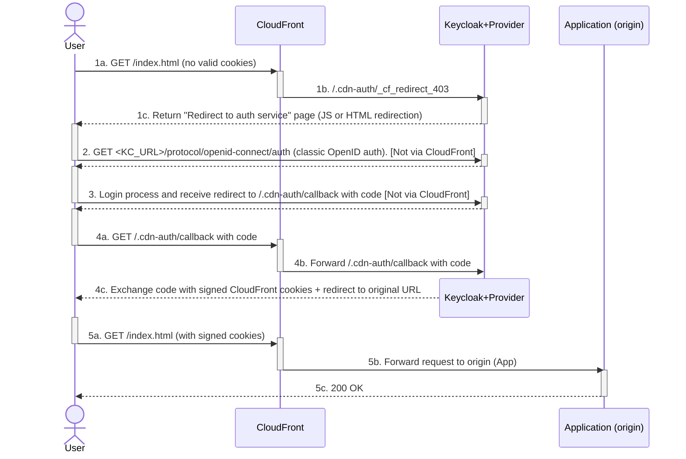

# Keycloak CloudFront Auth Extension

> Protégez simplement et nativement vos applications publiées sur AWS CloudFront avec Keycloak.

## Présentation

### Fonctionnalités principales
- [x] Génération de cookies CloudFront signés pour l'accès aux ressources protégées.
- [x] Gestion du flux d'authentification entre Keycloak et CloudFront (login, callback, erreurs).
- [x] Ajout optionnel d'un cookie contenant l'access-token JWT de l'utilisateur pour le client OpenID, à destination de l'application.

Le fonctionnement de l'extension est détaillé dans la section [Fonctionnement](#fonctionnement).

### Avantages
- Intégration rapide et transparente avec Keycloak via un client OpenID standard.
- Aucune fonction CloudFront ou Lambda@Edge requise (protection native via cookies signés).
- Possibilité de protéger la distribution complète (assets, API, etc.) ou uniquement certains comportements CloudFront, en déportant la gestion de l'authentification vers Keycloak.
- Simplification de l'intégration OpenID côté application (flux d'authentification géré par l'extension, avec mise à disposition optionnelle d'un access-token JWT via un cookie configurable).

### Cas d'usage
- Protéger une application Web JavaScript : accès restreint aux ressources de la distribution (assets + API), récupération simplifiée d'un token JWT.
- Donner un accès sécurisé via Internet à une application normalement accessible via VPN (solution de type reverse proxy avec authentification, en utilisant une origine VPC dans CloudFront).
- Implémenter une authentification OpenID dans une application Web sans développer le flux d'authentification.

### Versions de Keycloak supportées
Actuellement, l'extension prend en charge les versions : `25.0`, `26.0`, `26.1`, `26.2` et `26.3`.


> [!IMPORTANT]
> L'extension est jeune et en développement actif. Bien qu'elle soit déjà utilisée en production, il est recommandé de la tester soigneusement dans votre contexte. N'hésitez pas à signaler tout problème ou à proposer des améliorations depuis la page [Issues](https://github.com/jul-m/keycloak-cloudfront-auth/issues).

## Démarrage rapide
### Démonstration

Pour avoir un aperçu du fonctionnement de l'extension, un environnement de démo Docker est disponible via un fichier `compose.yml`. Cet environnement contient :
- Un conteneur Keycloak préconfiguré avec l'extension.
- Un conteneur "CloudFront Auth Simulator", afin de tester sans déploiement sur AWS et d'obtenir des informations détaillées sur l'authentification.

```bash
curl -fsSL https://raw.githubusercontent.com/jul-m/keycloak-cloudfront-auth/refs/heads/main/docker/demo/compose.yml | docker compose -f - up -d
```

→ Rendez-vous sur la page [docker/demo/README.FR.md](docker/demo/README.FR.md) pour la procédure complète.


### Installation
- Téléchargez la dernière version de l'extension à partir de la page des [releases](https://github.com/jul-m/keycloak-cloudfront-auth/releases) (sélectionnez le fichier JAR correspondant à votre version de Keycloak).
- Copiez le fichier JAR dans le dossier `providers/`.
- Si nécessaire, modifiez la configuration globale de l'extension (via variables d'environnement, fichier `conf/keycloak.conf` ou paramètres en ligne de commande). Consultez la section [Configuration Globale](#configuration-globale).
- Redémarrez Keycloak.
- Vérifiez que l'extension est bien chargée dans Keycloak, depuis l'accueil du realm **master**, onglet `Provider info`. L'extension doit apparaître dans deux SPI :
  - `protocol-mapper`: `oidc-cloudfront-auth-config-mapper` doit être présent.
   - `realm-restapi-extension`: une liste `cloudfront-auth` doit présenter la version de l'extension, ainsi que les options de configuration globales appliquées.

### Protection d'une distribution
Sur Keycloak:
- Créer un client OpenID dans Keycloak, en activant `Client authentication` et `Standard flow` avec une URL de redirection vers `https://<CLOUDFRONT_DOMAIN>/.cdn-auth/callback/*`.
- Ajouter le rôle `cloudfront-access` au client, puis l'assigner aux utilisateurs/groupes autorisés à accéder aux ressources protégées (noms de rôles [configurables](#configuration-globale)).
- Optionnel : Ajouter un mapper de type `CloudFront Auth Client Config` au client pour configurer un cookie contenant l'access-token JWT pour l'application.

Sur CloudFront:
- Importer la clé publique RSA par défaut du realm Keycloak dans CloudFront, puis créer un groupe de clés (utilisable par toutes les distributions du même compte AWS).
- Sur la distribution à protéger, ajouter l'instance Keycloak comme origine avec l'URL `https://<KC_URL>/cloudfront-auth/`, en ajoutant les en‑têtes (headers) `kc-realm-name`, `kc-client-id`, `kc-client-secret` et `kc-cf-sign-key-id`.
- Ajouter un comportement pour le chemin `/.cdn-auth/*` vers l'origine Keycloak, avec un accès public.
- Ajouter une règle de réponse personnalisée 403 redirigeant vers `/.cdn-auth/_cf_redirect_403` (sans cache).
- Pour les comportements à protéger, activer l'accès restreint en autorisant le groupe de clés contenant celle du realm Keycloak.

→ Consulter la page [docs/configuration-guide.FR](docs/configuration-guide.FR.md#configuration-distribution) pour la procédure complète.


## Fonctionnement
### Flux d'authentification CloudFront



Contexte : 1 distribution CloudFront avec :
- Clé RSA du realm Keycloak ajoutée dans un groupe de clés.
- 1 comportement pour `/.cdn-auth/*` vers origine `https://<KC_URL>/cloudfront-auth/`. Accès public.
- Comportement par défaut (`*`) vers l'origine de l'application. Accès restreint via cookies signés.
- Réponse erreur personnalisée 403 redirigeant vers `/.cdn-auth/_cf_redirect_403`.


Résumé du fonctionnement :
- `1`: Requête initiale
   - `1a`: Client → GET `/index.html` — le navigateur demande la ressource sans cookie signé valide.
   - `1b`: CloudFront → Ressource protégée, CloudFront génère une erreur 403. La règle de réponse personnalisée redirige en interne vers `/.cdn-auth/_cf_redirect_403`, qui correspond à l'origine Keycloak (le navigateur n'a pas connaissance de la redirection vers Keycloak).
   - `1c`: Extension → Génère une page HTML contenant une redirection (JavaScript ou *meta-refresh*) vers l'endpoint OIDC de Keycloak pour le login. Voir [Détails sur la page de redirection](#détails-sur-la-page-de-redirection).

- `2`: Client → GET `<KC_URL>/protocol/openid-connect/auth` — le navigateur est redirigé vers Keycloak pour le login (flux OIDC standard), via l'URL réelle du serveur Keycloak.

- `3`: L'utilisateur s'authentifie s'il n'est pas déjà authentifié sur le realm, puis si l'accès est accordé, il est redirigé vers le domaine de l'application, chemin `/.cdn-auth/callback` avec le code d'autorisation.

- `4`: Callback traité par l'extension
   - `4a`: Client → Suit la redirection vers `/.cdn-auth/callback` avec le code d'autorisation.
   - `4b`: CloudFront → Redirige la requête vers l'origine Keycloak, chemin `/cloudfront-auth/.cdn-auth/callback`.
   - `4c`: Extension → Échange le code d'autorisation contre un token JWT et génère les cookies CloudFront signés avec la clé RSA du realm. Réponse 302 avec redirection vers l'URL d'origine. Comme l'accès à cette page se fait via la distribution CloudFront de l'application, les cookies sont bien ajoutés au domaine de l'application. Voir [Détails sur le callback post-authentification](#détails-sur-le-callback-post-authentification).

- `5`: Accès à l'application
   - `5a`: Client → Suit la redirection vers `/index.html` (avec cookies signés).
   - `5b`: CloudFront → Les cookies sont validés et la requête est transmise à l'origine.
   - `5c`: Origine → L'origine envoie la ressource (200 OK) si elle n'est pas en cache sur CloudFront.


### Intégration avec CloudFront
L'extension expose un endpoint dédié `/cloudfront-auth/` accessible uniquement via CloudFront pour gérer l'authentification des utilisateurs. Cette intégration permet à CloudFront de se comporter comme un client OpenID confidentiel en transmettant les informations d'authentification via des en‑têtes HTTP personnalisés.

**Architecture de l'intégration :**
Le système repose sur l'ajout de l'endpoint `/cloudfront-auth/` comme origine CloudFront. Cette configuration permet deux mécanismes essentiels :
- **Redirection transparente** : CloudFront peut rediriger en interne les utilisateurs non authentifiés (via la règle d'erreur 403) vers une URL spécifique de l'origine Keycloak (`/cloudfront-auth/.cdn-auth/_cf_redirect_403`) afin d'initier le flux d'authentification. Du point de vue du navigateur, la page de redirection est générée par l'application. Cette intégration élimine la nécessité d'implémenter la logique de redirection dans une fonction CloudFront/Lambda@Edge ou dans l'application elle-même.
- **Génération de cookies sur le bon domaine** : lors du *callback* (`/cloudfront-auth/.cdn-auth/callback`), les cookies CloudFront signés sont générés par l'extension depuis le domaine de l'application, permettant leur lecture par CloudFront pour autoriser l'accès aux ressources protégées.

Les flux habituellement gérés par les clients OpenID eux-mêmes transitent donc par la distribution CloudFront, de manière transparente pour les utilisateurs, bien qu'ils soient techniquement pris en charge par l'extension côté Keycloak. Cette compatibilité avec les clients OpenID standard permet de configurer le client CloudFront comme un client OpenID classique. De plus, l'extension peut placer l'access-token JWT généré par l'authentification dans un cookie supplémentaire, facilitant ainsi son utilisation par l'application.

**Authentification via en‑têtes HTTP :**
CloudFront transmet les informations de configuration via des en‑têtes personnalisés, ajoutés automatiquement à chaque requête vers l'origine Keycloak (ils sont invisibles pour les utilisateurs) :
- `kc-realm-name` : nom du realm Keycloak à utiliser pour l'authentification.
- `kc-client-id` : identifiant du client OpenID configuré dans Keycloak.
- `kc-client-secret` : secret du client OpenID pour l'authentification confidentielle.
- `kc-cf-sign-key-id` : identifiant de la clé publique CloudFront correspondant à la clé privée du realm Keycloak. Cette valeur est incluse dans le cookie `CloudFront-Signature`. Elle indique à CloudFront la clé utilisée pour signer les cookies, et donc la clé publique à utiliser pour vérifier la signature.

**Sécurité de l'intégration :**
- Ces en‑têtes de configuration ne sont jamais exposés aux navigateurs des utilisateurs, car ils sont ajoutés uniquement dans les communications CloudFront → Keycloak.
- Le client secret reste protégé et n'est transmis que dans des communications chiffrées entre CloudFront et l'origine Keycloak (**il est fortement recommandé d'utiliser HTTPS**).
- Chaque distribution CloudFront peut utiliser son propre client, permettant l'isolation entre environnements ou applications.


### Détails de la page de redirection
Afin de gérer le cas d'un utilisateur non connecté sans recourir à des fonctions CloudFront ni à Lambda@Edge, l'extension utilise un mécanisme simple : lorsque CloudFront renvoie un 403 (cookies CloudFront signés manquants ou invalides), la distribution réécrit en interne la requête vers `/.cdn-auth/_cf_redirect_403` (origine Keycloak). L'extension retourne alors une page HTML légère qui redirige l'utilisateur vers l'endpoint OIDC de Keycloak pour l'authentification.

**La page HTML permet :**
- De gérer une redirection malgré l'impossibilité de convertir l'erreur 403 en code HTTP 302 dans la règle de réponse personnalisée 403.
- Si JavaScript est actif, de définir l'URL d'origine exacte (URL actuelle) dans les paramètres d'URL `redirect_uri` et `original_uri`, afin de rediriger l'utilisateur vers la ressource initialement demandée après authentification. Cela ne peut pas être géré par Keycloak directement, puisque celui-ci ne voit que l'appel vers l'endpoint `/cloudfront-auth/.cdn-auth/_cf_redirect_403` de son propre domaine.
- Si JavaScript n'est pas actif, une balise `meta-refresh` est utilisée pour rediriger l'utilisateur. Dans ce cas, après l'authentification, l'utilisateur sera redirigé vers l'URL définie dans `Root URL` et/ou `Home URL` au niveau du client OpenID (`Home URL` prioritaire si les deux sont définies), puisque l'URL d'origine exacte n'aura pas pu être déterminée avant la redirection.
- Un lien permet de forcer la redirection manuellement si la redirection automatique ne fonctionne pas. Si JavaScript est actif, les valeurs de `redirect_uri` et `original_uri` sont actualisées avec l'URL actuelle. Sinon, le lien contient la même valeur de secours que la redirection meta-refresh.

**Redirections :**
- Dans la page HTML générée par Keycloak, l'URL de redirection est construite en suivant ce modèle:
  `<keycloak_base_url>/realms/<realm_name>/protocol/openid-connect/auth?client_id=<client_id>&response_type=code&redirect_uri=<default_redirect_uri>&scope=openid`
- `<default_redirect_uri>` = `<home_url-OR-root_url>/.cdn-auth/callback`
- Mise à jour de `<default_redirect_uri>` dans le lien et redirections en JavaScript via ce modèle:
  `<current_origin>/.cdn-auth/callback?original_uri=<current_full_url_encoded>`


**Paramètres :**
- Le délai d'attente avant redirection peut être configuré via les [options globales](#configuration-globale) `redirect-delay` (redirection JavaScript, `0` par défaut = immédiate) et `redirect-fallback-delay` (redirection *meta-refresh* de secours, `2` par défaut).
- La gestion des traductions et du thème visuel de la page de redirection est en cours de développement.


### Détails sur le *callback* post-authentification
Après l'authentification réussie (l'utilisateur vient de saisir ses identifiants, ou avait déjà une session "SSO" active), l'utilisateur est redirigé vers l'endpoint `/.cdn-auth/callback` avec un code d'autorisation. L'extension traite cette requête pour échanger le code contre un token d'accès JWT, valide les autorisations de l'utilisateur (via les rôles clients définis par le [paramètre global](#configuration-globale) `access-roles`), puis génère les cookies CloudFront signés permettant l'accès aux ressources protégées. Le callback est géré par l'extension. Si l'option est activée, le token d'accès JWT peux également être ajouté à un cookie afin d'être utilisé par l'application.

**Le traitement du callback comprend :**
- Validation et échange du code d'autorisation OAuth2 contre un token d'accès JWT, en interne.
- Vérification que l'utilisateur dispose du rôle requis dans le client OpenID pour accéder aux ressources protégées (`cloudfront-access` par défaut, [configurable](#configuration-globale)).
- Génération des trois cookies CloudFront signés (`CloudFront-Policy`, `CloudFront-Signature`, `CloudFront-Key-Pair-Id`) avec la clé RSA privée du realm Keycloak. La politique définit l'URL des ressources autorisées et la date d'expiration, basée sur la durée de vie de l'access-token.
- Génération optionnelle d'un cookie contenant l'access-token JWT si un mapper de type `CloudFront Auth Client Config` est configuré sur le client.
- Redirection HTTP 302 vers l'URL d'origine (paramètre `original_uri`) ou vers l'URL définie dans `Home URL`/`Root URL` du client si `original_uri` n'est pas disponible.

**Gestion des autorisations :**
- L'utilisateur doit disposer du rôle client `cloudfront-access` (ou un rôle configuré via les [options globales](#configuration-globale)) pour obtenir les cookies signés.
- Si l'utilisateur n'a pas le rôle requis, une erreur 401 "Access denied" est retournée.
- Les rôles peuvent être assignés directement aux utilisateurs ou via des rôles composites et des mappings de groupes selon les mécanismes standards de Keycloak.

**Cookies générés :**
- `CloudFront-Policy` : Politique signée contenant l'URL des ressources autorisées (`<scheme>://<domain>/*`) et la date d'expiration.
- `CloudFront-Signature` : Signature cryptographique de la politique générée avec la clé RSA privée du realm.
- `CloudFront-Key-Pair-Id` : Identifiant de la clé publique CloudFront correspondant à la clé privée utilisée pour signer.
- Cookie JWT optionnel : Access-token JWT avec attributs configurables (nom, path, sécurité) via le mapper `CloudFront Auth Client Config`.

**Protection contre les boucles de redirection :**
- Un cookie de détection de boucle (`cloudfront_auth_loop`) est incrémenté à chaque passage par le callback. La durée de vie du cookie est très courte (1 minute).
- Si le seuil de 10 redirections est atteint dans la minute, une erreur 310 est retournée pour éviter les boucles infinies.
- Ce mécanisme protège contre les erreurs de configuration qui pourraient causer des redirections infinies (plusieurs redirections par seconde pendant un temps prolongé).

**Paramètres :**
- La durée de validité définie dans la politique du cookie `CloudFront-Policy` est déterminée par la durée de vie de l'access-token du client OpenID (configurable dans Keycloak).
- Par défaut, la durée de vie des cookies eux-mêmes correspond à la session du navigateur. Ce comportement peut être modifié via les [options globales](#configuration-globale).
- Les attributs du cookie JWT optionnel sont configurables via le mapper `CloudFront Auth Client Config`.
- Les rôles requis pour l'accès sont configurables via les [options globales](#configuration-globale).
- Les détails concernant les durées de vie et la configuration des cookies sont disponibles dans [docs/configuration-guide.FR.md > Configuration Keycloak](docs/configuration-guide.FR.md#configuration-keycloak).


### Limitations
- En raison de la règle de réponse personnalisée 403 de CloudFront, les applications protégées ne doivent pas retourner d'erreur 403. Dans le cas contraire, CloudFront interprétera l'erreur comme une absence de cookies signés valides et redirigera vers Keycloak, provoquant une boucle de redirection avant l'émission d'une erreur 310. Malheureusement, il n'est pas possible de distinguer une erreur 403 générée par l'application d'une erreur 403 causée par des cookies manquants ou invalides sans recourir à des fonctions CloudFront ou à Lambda@Edge. **Si possible, remplacez les erreurs 403 par des erreurs 401.**
- Rafraîchissement des cookies : à ce jour, il n'y a pas de mécanisme de rafraîchissement en arrière-plan des cookies signés intégré à l'extension. Cette fonctionnalité est envisagée pour de futures versions. En attendant, évitez d'utiliser une durée de validité trop courte, qui entraînerait des réauthentifications fréquentes (flux de redirection login → callback → génération des cookies), potentiellement perceptibles par l'utilisateur. Pour les applications SPA dont les API transitent par CloudFront, l'expiration nécessitera un rechargement de la page pour obtenir de nouveaux cookies signés. Il est recommandé d'implémenter côté client une détection d'expiration et un rechargement automatique si nécessaire. Pour plus de détails, consultez la 3ᵉ section de [*Configuration Keycloak* dans configuration-guide.FR.md](docs/configuration-guide.FR.md#configuration-keycloak).


## Configuration
### Configuration Globale

Certaines options de l'extension sont définies au niveau du système de configuration Keycloak.
Toutes les options ont une valeur par défaut (affichées ci-dessous) et sont donc optionnelles.

```properties
# conf/keycloak.conf:
spi-realm-restapi-extension-cloudfront-auth-redirect-delay=0
spi-realm-restapi-extension-cloudfront-auth-redirect-fallback-delay=2
spi-realm-restapi-extension-cloudfront-auth-display-request-id=true
spi-realm-restapi-extension-cloudfront-auth-access-roles=cloudfront-access
spi-realm-restapi-extension-cloudfront-auth-auth-cookies-attributes=Path=/; HttpOnly

# Variables d'environnement:
KC_SPI_REALM_RESTAPI_EXTENSION_CLOUDFRONT_AUTH_REDIRECT_DELAY=0
KC_SPI_REALM_RESTAPI_EXTENSION_CLOUDFRONT_AUTH_REDIRECT_FALLBACK_DELAY=2
KC_SPI_REALM_RESTAPI_EXTENSION_CLOUDFRONT_AUTH_DISPLAY_REQUEST_ID=true
KC_SPI_REALM_RESTAPI_EXTENSION_CLOUDFRONT_AUTH_ACCESS_ROLES=cloudfront-access
KC_SPI_REALM_RESTAPI_EXTENSION_CLOUDFRONT_AUTH_AUTH_COOKIES_ATTRIBUTES=Path=/; HttpOnly

# Arguments ligne de commande:
--spi-realm-restapi-extension-cloudfront-auth-redirect-delay=0
--spi-realm-restapi-extension-cloudfront-auth-redirect-fallback-delay=2
--spi-realm-restapi-extension-cloudfront-auth-display-request-id=true
--spi-realm-restapi-extension-cloudfront-auth-access-roles=cloudfront-access
--spi-realm-restapi-extension-cloudfront-auth-auth-cookies-attributes=Path=/; HttpOnly
```

- `spi-realm-restapi-extension-cloudfront-auth-redirect-delay` : Page de redirection vers l'authentification : Délai en secondes avant redirection (via JavaScript). `0` = pas de délai.
- `spi-realm-restapi-extension-cloudfront-auth-redirect-fallback-delay` : Page de redirection vers l'authentification : Délai en secondes avant redirection de secours (via meta-refresh). `0` = pas de délai.
- `spi-realm-restapi-extension-cloudfront-auth-display-request-id` : Afficher l'ID de requête dans les pages d'erreur (utile pour le support).
- `spi-realm-restapi-extension-cloudfront-auth-access-roles` : Liste de noms de rôles client (séparés par des virgules). Les utilisateurs devront avoir au moins un de ces rôles pour générer les cookies signés pour le client. Si vide, tout utilisateur authentifié peut accéder.
- `spi-realm-restapi-extension-cloudfront-auth-auth-cookies-attributes` : Attributs ajoutés aux cookies d'authentification.


### Configuration du client et de CloudFront
Voir la page [docs/configuration-guide.FR](docs/configuration-guide.FR.md#configuration-distribution).


## Build & Tests

Le script `run.sh` à la racine de ce dépôt permet de réaliser la plupart des actions de build et de test pour ce projet.
Il contient plusieurs sous-commandes avec leurs propres options. Pour afficher l'aide : `./run.sh help` ou `./run.sh <subcommand> help`.

- `build`: produit les artefacts JAR compatibles avec différentes versions de Keycloak, avec des options pour les tests.
   - Options utiles:
      - `-t`, `--test` : après un build réussi, lance les tests d'intégration (`scripts/test-integration.sh`).
      - `--keep-containers=POLICY` : transmis au runner de tests si `-t` est utilisé. `POLICY` vaut `never` (défaut), `on-failure` ou `always`.
      - `-r`, `--run` : après un build réussi, lance automatiquement la stack Docker `dev-tests` avec l'extension Keycloak construite.
        Si aucune version n'est fournie, la version la plus récente sera utilisée. Cette option est incompatible avec `-t/--test`.
   - Usage courant :
      - `./run.sh build` # Build toutes les versions supportées
      - `./run.sh build 26.0` # Build pour Keycloak 26.0
      - `./run.sh build 26.0 -r` # Build pour Keycloak 26.0, puis lance un container dev-tests avec ce build
      - `./run.sh build -t --keep-containers=on-failure 26.0` # Build avec tests d'intégration, conserve les conteneurs en cas d'échec

- `docker-build`: pour construire les images Docker du projet.
   - `./run.sh docker-build cf-auth-sim [<tags>...]` : construit l'image du simulateur CloudFront Auth.
   - `./run.sh docker-build dev-tests [<tags>...]` : construit l'image de test avec Keycloak + provider monté.

- `docker-run`: lance des stacks Docker prédéfinies via `docker compose`.
   - Stacks disponibles : `demo` (fichier `docker/demo/compose.yml`) et `dev-tests` (fichier `docker/dev-tests/compose.yml`).
   - Options et comportement :
      - Sans option `-d` (par défaut) : le wrapper exécute `docker compose up` au premier plan et affiche la sortie en direct — aucun redémarrage automatisé n'est effectué.
         - Avec `-d` ou `--detach` : le wrapper lance `docker compose up -d` (mode détaché). Dans ce cas, si `docker compose up` n'a effectué aucun changement
            (les conteneurs existaient déjà avec la même configuration et étaient démarrés), le script exécute `docker compose restart` pour redémarrer
            proprement les conteneurs existants. Cette logique évite la recréation non désirée tout en assurant un redémarrage lorsque nécessaire.
   - Exemples :
      - `./run.sh docker-run demo` (premier plan, sortie en direct)
      - `./run.sh docker-run dev-tests -d` (détaché, avec logique de redémarrage si compose n'a rien modifié)

