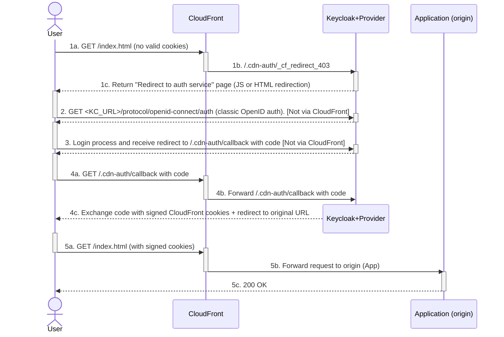

# Keycloak CloudFront Auth Extension
> Protect your applications published on AWS CloudFront with Keycloak, simply and natively.

[Version Française - French Version](README.FR.md)

## Overview

### Key features
- [x] Generates signed CloudFront cookies to access protected resources.
- [x] Manages the authentication flow between Keycloak and CloudFront (login, callback, errors).
- [x] Optional cookie containing the user's OpenID client access token (JWT) for the application.

Details about how the extension works are in [How it works](#how-it-works).

### Benefits
- Fast and seamless integration with Keycloak via a standard OpenID client.
- No CloudFront Function or Lambda@Edge required (native protection via signed cookies).
- Protect an entire distribution (assets, APIs, etc.) or only specific CloudFront behaviors, offloading authentication to Keycloak.
- Simplifies OpenID integration in your app (the extension manages the auth flow and can provide a JWT access token via a configurable cookie).

### Use cases
- Protect a JavaScript web app: restrict access to distribution resources (assets + APIs) and easily obtain a JWT token.
- Provide secure Internet access to an app usually available via VPN (reverse proxy approach using a VPC origin in CloudFront).
- Implement OpenID authentication in a web application without coding the auth flow.

### Supported Keycloak versions
Currently supported: `25.0`, `26.0`, `26.1`, `26.2`, and `26.3`.


> [!IMPORTANT]
> The extension is young and under active development. Although it is already used in production, test it thoroughly in your context. Please report issues or suggest improvements via [Issues](https://github.com/jul-m/keycloak-cloudfront-auth/issues).

## Quick start
### Demo

To try the extension, a Docker demo environment is available via a `compose.yml` file. It contains:
- A preconfigured Keycloak container with the extension.
- A "CloudFront Auth Simulator" container to test without deploying on AWS and to get detailed diagnostics.

```bash
curl -fsSL https://raw.githubusercontent.com/jul-m/keycloak-cloudfront-auth/refs/heads/main/docker/demo/compose.yml | docker compose -f - up -d
```

→ See [docker/demo/README.md](docker/demo/README.md) for the full procedure.


### Installation
- Download the latest release from the [releases](https://github.com/jul-m/keycloak-cloudfront-auth/releases) page (pick the JAR matching your Keycloak version).
- Copy the JAR into the `providers/` folder.
- If needed, adjust the global configuration (via environment variables, `conf/keycloak.conf`, or CLI args). See [Global Configuration](#global-configuration).
- Restart Keycloak.
- Verify the extension is loaded in Keycloak from the **master** realm home, `Provider info` tab. It should appear in two SPIs:
   - `protocol-mapper`: `oidc-cloudfront-auth-config-mapper` must be present.
   - `realm-restapi-extension`: a `cloudfront-auth` entry shows the extension version and the applied global configuration options.

### Protect a distribution
On Keycloak:
- Create an OpenID client with `Client authentication` and `Standard flow` enabled, and add a redirect URI `https://<CLOUDFRONT_DOMAIN>/.cdn-auth/callback/*`.
- Add the `cloudfront-access` role to the client, then assign it to the users/groups allowed to access protected resources (role names are [configurable](#global-configuration)).
- Optional: add a `CloudFront Auth Client Config` mapper to set a cookie containing the JWT access token for the application.

On CloudFront:
- Import the realm's default RSA public key into CloudFront and create a key group (reusable across distributions in the same AWS account).
- In the distribution to protect, add Keycloak as an origin with URL `https://<KC_URL>/cloudfront-auth/` and add headers `kc-realm-name`, `kc-client-id`, `kc-client-secret`, and `kc-cf-sign-key-id`.
- Add a behavior for `/.cdn-auth/*` that targets the Keycloak origin with public access.
- Add a 403 custom error response redirecting to `/.cdn-auth/_cf_redirect_403` (no cache).
- For protected behaviors, enable restricted viewer access and allow the key group containing the Keycloak realm key.

→ See [docs/configuration-guide.md](docs/configuration-guide.md) for the full step-by-step guide.


## How it works
### CloudFront authentication flow



Context: one CloudFront distribution with:
- The Keycloak realm RSA key added in a key group.
- One behavior for `/.cdn-auth/*` pointing to `https://<KC_URL>/cloudfront-auth/` (public access).
- Default behavior (`*`) to the application origin (restricted via signed cookies).
- A 403 custom error response rewriting to `/.cdn-auth/_cf_redirect_403`.


Flow summary:
- `1`: Initial request
   - `1a`: Client → GET `/index.html` — the browser requests the resource without valid signed cookies.
   - `1b`: CloudFront → Protected resource: CloudFront returns 403. The custom error response internally rewrites to `/.cdn-auth/_cf_redirect_403` (Keycloak origin). The browser doesn't see this internal hop.
   - `1c`: Extension → Returns a small HTML page that redirects (JavaScript or meta-refresh) to Keycloak's OIDC auth endpoint. See [Redirection page details](#redirection-page-details).

- `2`: Client → GET `<KC_URL>/protocol/openid-connect/auth` — the browser is redirected to Keycloak for login (standard OIDC), using the real Keycloak URL.

- `3`: The user authenticates; if authorized, they're redirected to the application domain at `/.cdn-auth/callback` with the authorization code.

- `4`: Callback handled by the extension
   - `4a`: Client → Follows the redirect to `/.cdn-auth/callback` with the code.
   - `4b`: CloudFront → Forwards to the Keycloak origin path `/cloudfront-auth/.cdn-auth/callback`.
   - `4c`: Extension → Exchanges the code for a JWT access token and generates signed CloudFront cookies with the realm RSA key. Responds 302 to the original URL. Because this goes through the application distribution, cookies are set on the app domain. See [Post-authentication callback details](#post-authentication-callback-details).

- `5`: Application access
   - `5a`: Client → Follows the redirect to `/index.html` (with signed cookies).
   - `5b`: CloudFront → Validates cookies and forwards to the origin.
   - `5c`: Origin → Returns the resource (200 OK) if not already cached.


### CloudFront integration
The extension exposes a dedicated endpoint `/cloudfront-auth/` reachable only via CloudFront to handle user authentication. This lets CloudFront behave as a confidential OpenID client by passing auth configuration via custom HTTP headers.

**Integration architecture:**
Adding `/cloudfront-auth/` as a CloudFront origin enables two key mechanisms:
- **Transparent redirection:** Unauthenticated users (403) are internally rewritten to `/cloudfront-auth/.cdn-auth/_cf_redirect_403` on the Keycloak origin to initiate authentication. From the browser perspective, the page appears to come from the application. No CloudFront Functions/Lambda@Edge or app changes are needed.
- **Cookies on the correct domain:** During the callback (`/cloudfront-auth/.cdn-auth/callback`), the extension sets the signed CloudFront cookies from the application domain so CloudFront can read them for protected resources.

Auth flows typically handled by OpenID clients thus go through the CloudFront distribution, transparently for users, though they are implemented in the extension on the Keycloak side. This remains compatible with standard OpenID clients. Optionally, the extension can also set the JWT access token in an additional cookie for the app.

**Authentication via HTTP headers:**
CloudFront passes custom headers, automatically added to each request to the Keycloak origin (never visible to end users):
- `kc-realm-name`: Keycloak realm name to use for authentication.
- `kc-client-id`: OpenID client ID configured in Keycloak.
- `kc-client-secret`: Client secret for confidential auth.
- `kc-cf-sign-key-id`: CloudFront public key ID that corresponds to the realm private key. This goes into the `CloudFront-Key-Pair-Id` cookie and tells CloudFront which public key to use to verify the signature.

**Security:**
- These headers are never exposed to browsers; they are only added in CloudFront → Keycloak communications.
- The client secret remains protected and is transmitted only over TLS between CloudFront and the Keycloak origin (**HTTPS strongly recommended**).
- Each distribution can use its own client, allowing environment/application isolation.


### Redirection page details
To handle unauthenticated users without CloudFront Functions or Lambda@Edge, the extension uses a simple mechanism: when CloudFront returns a 403 (missing/invalid signed cookies), the distribution internally rewrites the request to `/.cdn-auth/_cf_redirect_403` (Keycloak origin). The extension returns a tiny HTML page that redirects the user to Keycloak's OIDC endpoint.

**The HTML page allows:**
- Redirecting despite the inability to change the 403 into a 302 in the CloudFront custom error response.
- If JavaScript is enabled, capturing the exact original URL (current URL) and injecting it into `redirect_uri` and `original_uri` so the user is redirected back to the originally requested resource after login. Keycloak itself cannot know this exact URL because it only sees the request to `/cloudfront-auth/.cdn-auth/_cf_redirect_403` on its own domain.
- If JavaScript is disabled, a `meta-refresh` fallback is used. In that case, after authentication, the user is redirected to the client's `Home URL` and/or `Root URL` (`Home URL` wins if both set), because the exact original URL could not be determined.
- A manual link is provided if automatic redirection fails. If JavaScript is enabled, `redirect_uri` and `original_uri` are updated with the current URL; otherwise the link uses the same fallback as the meta-refresh.

**Redirections:**
- In the Keycloak-generated HTML, the redirect URL follows this template:
   `<keycloak_base_url>/realms/<realm_name>/protocol/openid-connect/auth?client_id=<client_id>&response_type=code&redirect_uri=<default_redirect_uri>&scope=openid`
- `<default_redirect_uri>` = `<home_url-OR-root_url>/.cdn-auth/callback`
- When JS runs, the link and redirects are updated to:
   `<current_origin>/.cdn-auth/callback?original_uri=<current_full_url_encoded>`


**Parameters:**
- The delay before redirect is configurable via [Global Configuration](#global-configuration): `redirect-delay` (JavaScript redirect, default `0`) and `redirect-fallback-delay` (meta-refresh fallback, default `2`).
- Translations and theming of the redirect page are under development.


### Post-authentication callback details
After successful authentication (fresh login or existing SSO session), the user is redirected to `/.cdn-auth/callback` with an authorization code. The extension exchanges the code for a JWT access token, validates user authorization (client roles defined by the [global option](#global-configuration) `access-roles`), then generates the signed CloudFront cookies that grant access to protected resources. If enabled, the JWT token can also be set in a separate cookie for the application.

**Callback processing includes:**
- Validating and exchanging the OAuth2 authorization code for a JWT access token.
- Checking the user has the required client role (`cloudfront-access` by default, [configurable](#global-configuration)).
- Generating the three signed cookies (`CloudFront-Policy`, `CloudFront-Signature`, `CloudFront-Key-Pair-Id`) with the Keycloak realm RSA private key. The policy defines the allowed resource URL and expiration based on the access token lifespan.
- Optionally generating a cookie containing the JWT access token if a `CloudFront Auth Client Config` mapper is configured on the client.
- Returning an HTTP 302 to the original URL (`original_uri`) or to the client's `Home URL`/`Root URL` if `original_uri` is not available.

**Authorization handling:**
- The user must have the `cloudfront-access` client role (or any of the roles configured via [Global Configuration](#global-configuration)) to obtain signed cookies.
- If not authorized, a 401 "Access denied" is returned.
- Roles can be assigned directly to users or via composites/group mappings using standard Keycloak mechanisms.

**Cookies generated:**
- `CloudFront-Policy`: Signed policy containing allowed resources (`<scheme>://<domain>/*`) and expiration date.
- `CloudFront-Signature`: Cryptographic signature of the policy using the realm's private key.
- `CloudFront-Key-Pair-Id`: ID of the CloudFront public key matching the private key used to sign.
- Optional JWT cookie: Access token JWT with configurable attributes (name, path, security) via the `CloudFront Auth Client Config` mapper.

**Protection against redirect loops:**
- A loop-detection cookie (`cloudfront_auth_loop`) is incremented on each callback. Very short lifespan (1 minute).
- If 10 redirects occur within a minute, an error 310 is returned to prevent infinite loops.
- This protects against misconfigurations that could cause endless redirects.

**Parameters:**
- The validity period in `CloudFront-Policy` is determined by the OpenID client access token lifespan (configurable in Keycloak).
- By default, the cookies themselves are session cookies. This can be changed via [Global Configuration](#global-configuration).
- The optional JWT cookie attributes are configured via the `CloudFront Auth Client Config` mapper.
- Required roles are configured via [Global Configuration](#global-configuration).
- For details about lifetimes and cookie configuration, see [docs/configuration-guide.md > Keycloak configuration](docs/configuration-guide.md#keycloak-configuration).


### Limitations
- Because of the 403 custom error response in CloudFront, protected applications should not return 403 errors. Otherwise CloudFront will treat them as missing/invalid cookies and start the auth flow, causing a redirect loop until error 310. It's not possible to distinguish app-generated 403 from cookie-related 403 without CloudFront Functions/Lambda@Edge. **Prefer 401 over 403 where possible.**
- Cookie refresh: there is currently no background refresh mechanism for signed cookies. This may come in future versions. In the meantime, avoid very short lifetimes that cause frequent re-auth (login → callback → cookie generation), which users may notice. For SPAs whose APIs go through CloudFront, expiration will require a page reload to get fresh cookies. Implement client-side detection and auto-reload if needed. See section 3 in [Keycloak configuration in configuration-guide.md](docs/configuration-guide.md#keycloak-configuration).


## Configuration
### Global Configuration

Some options are defined at the Keycloak configuration system level.
All options have default values (shown below) and are thus optional.

```properties
# conf/keycloak.conf:
spi-realm-restapi-extension-cloudfront-auth-redirect-delay=0
spi-realm-restapi-extension-cloudfront-auth-redirect-fallback-delay=2
spi-realm-restapi-extension-cloudfront-auth-display-request-id=true
spi-realm-restapi-extension-cloudfront-auth-access-roles=cloudfront-access
spi-realm-restapi-extension-cloudfront-auth-auth-cookies-attributes=Path=/; HttpOnly

# Environment variables:
KC_SPI_REALM_RESTAPI_EXTENSION_CLOUDFRONT_AUTH_REDIRECT_DELAY=0
KC_SPI_REALM_RESTAPI_EXTENSION_CLOUDFRONT_AUTH_REDIRECT_FALLBACK_DELAY=2
KC_SPI_REALM_RESTAPI_EXTENSION_CLOUDFRONT_AUTH_DISPLAY_REQUEST_ID=true
KC_SPI_REALM_RESTAPI_EXTENSION_CLOUDFRONT_AUTH_ACCESS_ROLES=cloudfront-access
KC_SPI_REALM_RESTAPI_EXTENSION_CLOUDFRONT_AUTH_AUTH_COOKIES_ATTRIBUTES=Path=/; HttpOnly

# Command-line arguments:
--spi-realm-restapi-extension-cloudfront-auth-redirect-delay=0
--spi-realm-restapi-extension-cloudfront-auth-redirect-fallback-delay=2
--spi-realm-restapi-extension-cloudfront-auth-display-request-id=true
--spi-realm-restapi-extension-cloudfront-auth-access-roles=cloudfront-access
--spi-realm-restapi-extension-cloudfront-auth-auth-cookies-attributes=Path=/; HttpOnly
```

- `spi-realm-restapi-extension-cloudfront-auth-redirect-delay`: Redirect page → delay (seconds) before JavaScript redirect. `0` = no delay.
- `spi-realm-restapi-extension-cloudfront-auth-redirect-fallback-delay`: Redirect page → delay (seconds) before meta-refresh fallback. `0` = no delay.
- `spi-realm-restapi-extension-cloudfront-auth-display-request-id`: Display request ID on error pages (useful for support).
- `spi-realm-restapi-extension-cloudfront-auth-access-roles`: Comma-separated list of client role names. Users must have at least one of these to get signed cookies. If empty, any authenticated user is allowed.
- `spi-realm-restapi-extension-cloudfront-auth-auth-cookies-attributes`: Attributes added to authentication cookies.


### Client and CloudFront configuration
See [docs/configuration-guide.md](docs/configuration-guide.md).


## Build & tests

The `run.sh` script at the repo root helps with most build and test actions. It exposes several subcommands; see `./run.sh help` or `./run.sh <subcommand> help`.

- `build`: produces JAR artifacts compatible with supported Keycloak versions, with testing options.
   - Useful options:
      - `-t`, `--test`: after a successful build, run integration tests (`scripts/test-integration.sh`).
      - `--keep-containers=POLICY`: passed to the test runner when using `-t`. `POLICY` is `never` (default), `on-failure`, or `always`.
      - `-r`, `--run`: after a successful build, automatically start the `dev-tests` Docker stack with the built extension. If no version is provided, the latest supported one is used. Incompatible with `-t/--test`.
   - Common usage:
      - `./run.sh build` — Build all supported versions
      - `./run.sh build 26.0` — Build for Keycloak 26.0
      - `./run.sh build 26.0 -r` — Build for Keycloak 26.0, then run a `dev-tests` container with this build
      - `./run.sh build -t --keep-containers=on-failure 26.0` — Build with integration tests; keep containers on failure

- `docker-build`: build project Docker images.
   - `./run.sh docker-build cf-auth-sim [<tags>...]`: build the CloudFront Auth simulator image.
   - `./run.sh docker-build dev-tests [<tags>...]`: build the test image with Keycloak + mounted provider.

- `docker-run`: start predefined Docker stacks using `docker compose`.
   - Stacks: `demo` (`docker/demo/compose.yml`) and `dev-tests` (`docker/dev-tests/compose.yml`).
   - Behavior:
      - Without `-d` (default): runs `docker compose up` in foreground and streams logs — no automatic restart.
      - With `-d` / `--detach`: runs `docker compose up -d` (detached). If compose didn't change anything (containers already running unchanged), the script runs `docker compose restart` to cleanly restart existing containers. This avoids unnecessary recreation but ensures a restart when needed.
   - Examples:
      - `./run.sh docker-run demo` (foreground)
      - `./run.sh docker-run dev-tests -d` (detached, with restart logic if compose made no changes)

