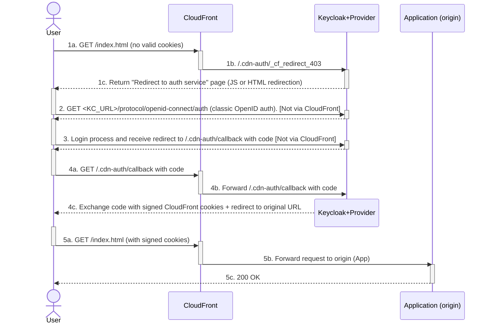

# Keycloak CloudFront Auth Extension

> Protégez simplement et nativement vos applications publiées sur AWS CloudFront avec Keycloak.

## Présentation

### Fonctionalités principales
- [x] Génération de "cookies CloudFront signés" pour l'accès aux ressources protégées.
- [x] Gestion du flux d'authentification entre Keycloak et CloudFront (login, callback, erreurs).
- [x] Ajout optionnel d'un cookie contenant l'access-token JWT de l'utilisateur et client OpenID à destination de l'application.

### Avantages
- Intégration transparente et rapide avec Keycloak via un client OpenID classique.
- Pas de fonctions CloudFront ou Lambda@Edge nécessaires (protection native via cookies signés).
- Possibilité de protéger la distribution complète (assets, API...) en déportant la gestion de l'authentification vers Keycloak.
- Intégration de l'authentification OpenID simplifiée au sein de l'application (flux d'authentification déjà géré avec mise à disposition d'un access-token JWT via un cookie configurable).

Le fonctionnement de l'extension est détaillé dans la section [Fonctionnement](#fonctionnement).


## Démarrage rapide
### Démonstration

Pour avoir un aperçu du fonctionnement de l'extension, un environnement de démo Docker est disponible via un fichier `compose.yml`. Cet environnement contient :
- Un conteneur Keycloak préconfiguré avec l'extension.
- Un conteneur "CloudFront Auth Simulator", afin de tester sans déployment sur AWS et d'obtenir des informations détaillées sur l'authentification.

```bash
curl -fsSL https://raw.githubusercontent.com/jul-m/keycloak-cloudfront-auth/refs/heads/main/docker/demo/compose.yml | docker compose -f - up -d
```

Rendez-vous sur la page [démonstration](docker/dev-tests) pour la procédure complète.


### Installation
- Téléchargez la dernière version de l'extension à partir de la page de [release](https://github.com/jul-m/keycloak-cloudfront-auth/releases) (sélectionnez le fichier JAR correspondant à votre version de Keycloak).
- Copiez le fichier JAR dans le dossier `providers/`.
- Si nécéssaire, modifiez la configuration globale de l'extension (via variables d'environnement, fichier `conf/keycloak.conf` ou paramètres en ligne de commande). Consultez la section [Configuration Globale](#configuration-globale).
- Redémarrez Keycloak.
- Consultez la section [Points clés de configuration](#points-clés-de-configuration-ce-quil-faut-fournir) pour réaliser la configuration nécéssaire sur Keycloak et CloudFront.


## Fonctionnement
### Flux d'authentification CloudFront


```mermaid
sequenceDiagram
    actor User as User
    participant CF as CloudFront
    participant KC as Keycloak+Provider
    participant App as Application (origin)

    User->>+CF: 1a. GET /index.html (no valid cookies)
    CF->>-KC: 1b. /.cdn-auth/_cf_redirect_403
    activate KC
    KC-->>User: 1c. Return "Redirect to auth service" page (JS or HTML redirection)
    deactivate KC
    activate User

    User->>+KC: <br/>2. GET <KC_URL>/protocol/openid-connect/auth (classic OpenID auth). [Not via CloudFront]
    deactivate User
    KC-->>-User: 
    activate User
    User->>+KC: <br/>3. Login process and receive redirect to /.cdn-auth/callback with code [Not via CloudFront]
    deactivate User
    KC-->>-User: 

    activate User
    User->>+CF: <br/>4a. GET /.cdn-auth/callback with code
    deactivate User
    CF->>-KC: 4b. Forward /.cdn-auth/callback with code
    destroy KC
    KC-->>User: 4c. Exchange code with signed CloudFront cookies + redirect to original URL
    activate User

    User->>+CF: 5a. GET /index.html (with signed cookies)
    deactivate User
    CF->>-App: 5b. Forward request to origin (App)
    activate App
    App-->>User: 5c. 200 OK
    deactivate App
```

Contexte : 1 distribution CloudFront avec :
- Clé RSA du realm Keycloak ajouté dans un groupe de clés.
- 1 comportement pour `/.cdn-auth/*` vers origine `https://<KC_URL>/cloudfront-auth/`. Accès public.
- Comportement par défaut (`*`) vers l'origine de l'application. Accès restreint via cookies signés.
- Réponse erreur personnalisée 403 redirigeant vers `/.cdn-auth/_cf_redirect_403`.


Résumé du fonctionnement:
- `1`: Requête initiale
   - `1a`: Client → GET `/index.html` — le navigateur demande la ressource sans cookie signé valide.
   - `1b`: CloudFront → Ressource protégée, CloudFront génère une erreur 403. La règle de réponse personnalisée redirige en interne vers `/.cdn-auth/_cf_redirect_403`, qui correspond à l'origine Keycloak (le navigateur n'as pas connaissance de la redirection vers Keycloak).
   - `1c`: Extension → Génère une page HTML contenant une redirection (JavaScript ou meta-refresh) vers l'endpoint OIDC de Keycloak pour le login.

- `2`: Client → GET `<KC_URL>/protocol/openid-connect/auth` — le navigateur est redirigé vers Keycloak pour le login (flux OIDC standard), via l'URL rééle du serveur Keycloak.

- `3`: L'utilisateur s'authentifie s'il n'est pas déjà authentifié sur le realm, puis si l'accès est accordé, il est redirigé vers le domaine de l'application, chemin `/.cdn-auth/callback` avec le code d'autorisation.

- `4`: Callback traité par l'extension
   - `4a`: Client → Suit la redirection vers `/.cdn-auth/callback` avec le code d'autorisation.
   - `4b`: CloudFront → Redirige la requête vers l'origine Keycloak, chemin `/cloudfront-auth/.cdn-auth/callback`.
   - `4c`: Extension → Échange le code d'autorisation contre un token JWT et génère les cookies CloudFront signés avec la clé RSA du realm.
           Réponse 302 avec redirection vers l'URL d'origine.
           Comme l'accès à cette page se fait via la distribution CloudFront de l'application, les cookies sont bien ajoutés au domaine de l'application.

- `5`: Accès à l'application
   - `5a`: Client → Suit la redirection vers `/index.html` (avec cookies signés).
   - `5b`: CloudFront → Les cookies sont validés et la requête est transmise à l'origine.
   - `5c`: Origine → L'origine envoie la ressource (200 OK) si elle n'est pas en cache sur CloudFront.


## Configuration
### Configuration Globale

Certaines options de l'extension sont définies au niveau du système de configuration Keycloak.
Toutes les options ont une valeur par défaut (affichées ci-dessous) et sont donc optionnelles.

```properties
# conf/keycloak.conf:
spi-realm-restapi-extension-cloudfront-auth-redirect-delay=0
spi-realm-restapi-extension-cloudfront-auth-redirect-fallback-delay=5
spi-realm-restapi-extension-cloudfront-auth-display-request-id=true
spi-realm-restapi-extension-cloudfront-auth-access-roles=cloudfront-access,webapp-access
spi-realm-restapi-extension-cloudfront-auth-auth-cookies-attributes=Path=/; HttpOnly

# Variables d'environnement:
KC_SPI_REALM_RESTAPI_EXTENSION_CLOUDFRONT_AUTH_REDIRECT_DELAY=0
KC_SPI_REALM_RESTAPI_EXTENSION_CLOUDFRONT_AUTH_REDIRECT_FALLBACK_DELAY=5
KC_SPI_REALM_RESTAPI_EXTENSION_CLOUDFRONT_AUTH_DISPLAY_REQUEST_ID=true
KC_SPI_REALM_RESTAPI_EXTENSION_CLOUDFRONT_AUTH_ACCESS_ROLES=cloudfront-access,webapp-access
KC_SPI_REALM_RESTAPI_EXTENSION_CLOUDFRONT_AUTH_AUTH_COOKIES_ATTRIBUTES=Path=/; HttpOnly

# Arguments ligne de commande:
--spi-realm-restapi-extension-cloudfront-auth-redirect-delay=0
--spi-realm-restapi-extension-cloudfront-auth-redirect-fallback-delay=5
--spi-realm-restapi-extension-cloudfront-auth-display-request-id=true
--spi-realm-restapi-extension-cloudfront-auth-access-roles=cloudfront-access,webapp-access
--spi-realm-restapi-extension-cloudfront-auth-auth-cookies-attributes=Path=/; HttpOnly
```

- `spi-realm-restapi-extension-cloudfront-auth-redirect-delay` : Page de redirection vers l'authentification : Délai en secondes avant redirection (via JavaScript). `0` = pas de délai.
- `spi-realm-restapi-extension-cloudfront-auth-redirect-fallback-delay` : Page de redirection vers l'authentification : Délai en secondes avant redirection de secours (via meta-refresh). `0` = pas de délai.
- `spi-realm-restapi-extension-cloudfront-auth-display-request-id` : Afficher l'ID de requête dans les pages d'erreur (utile pour le support).
- `spi-realm-restapi-extension-cloudfront-auth-access-roles` : Liste de noms de rôles client (séparés par des virgules). Les utilisateurs devront avoir au moins un de ces rôles pour générer les cookies signés pour le client. Si vide, tout utilisateur authentifié peut accéder.
- `spi-realm-restapi-extension-cloudfront-auth-auth-cookies-attributes` : Attributs ajoutés aux cookies d'authentification.


### Configuration Client et CloudFront
Voir ...


## Build & Tests

Le script `run.sh` à la racine de ce dépôt permet de réaliser la plupart des actions de build et de test pour ce projet.
Il contient plusieurs sous-commandes avec leurs propres options. Pour afficher l'aide : `./run.sh help` ou `./run.sh <subcommand> help`.

- `build`: produit les artefacts JAR compatibles avec différentes versions de Keycloak, avec des options pour les tests.
   - Options utiles:
      - `-t`, `--test` : après un build réussi, lance les tests d'intégration (`scripts/test-integration.sh`).
      - `--keep-containers=POLICY` : transmis au runner de tests si `-t` est utilisé. `POLICY` vaut `never` (défaut), `on-failure` ou `always`.
      - `-r`, `--run` : après un build réussi, lance automatiquement la stack Docker `dev-tests` avec l'extension Keycloak construite.
        Si aucune version n'est fournie, la version plus récente sera utilisée. Cette option est incompatible avec `-t/--test`.
   - Usage courant :
      - `./run.sh build` # Build toutes les les versions supportées
      - `./run.sh build 26.0` # Build pour Keycloak 26.0
      - `./run.sh build 26.0 -r` # Build pour Keycloak 26.0, puis lance un container dev-tests avec ce build
      - `./run.sh build -t --keep-containers=on-failure 26.0` # Build avec tests d'intégration, conserve les conteneurs en cas d'échec

- `docker-build`: pour construire les images Docker du projet.
   - `./run.sh docker-build cf-auth-sim [<tags>...]` : construit l'image du simulateur CloudFront Auth.
   - `./run.sh docker-build dev-tests [<tags>...]` : construit l'image de test avec Keycloak + provider monté.

- `docker-run`: lance des stacks Docker prédéfinies via `docker compose`.
   - Stacks disponibles : `demo` (fichier `docker/demo/compose.yml`) et `dev-tests` (fichier `docker/dev-tests/compose.yml`).
   - Options et comportement :
      - Sans option `-d` (par défaut) : le wrapper exécute `docker compose up` au premier plan et affiche la sortie en direct — aucun redémarrage automatisé n'est effectué.
      - Avec `-d` ou `--detach` : le wrapper lance `docker compose up -d` (mode détaché). Dans ce cas, si `docker compose up` n'a effectué aucun changement
        (les containers existaient déjà avec la même configuration et étaient démarrés), le script lancera un `docker compose restart` pour redémarrer
        proprement les containers existants. Cette logique évite la recréation non désirée tout en assurant un redémarrage quand nécessaire.
   - Exemples :
      - `./run.sh docker-run demo` (foreground, sortie en direct)
      - `./run.sh docker-run dev-tests -d` (detached, avec logique de redémarrage si compose n'a rien modifié)

