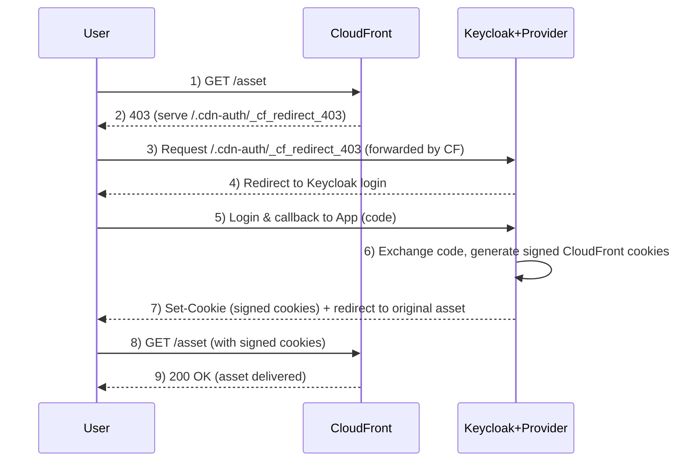

# Keycloak CloudFront Auth — intégration simple Keycloak ↔ CloudFront

Ce projet fournit une extension Keycloak (un « provider ») qui permet de protéger des sites ou assets servis par Amazon CloudFront en déléguant l'authentification à Keycloak.

## Pourquoi utiliser cette extension ? (problème & bénéfices)

Problème courant : vous avez des ressources statiques (site, images, vidéos) servies par CloudFront et vous souhaitez restreindre l'accès à certains utilisateurs ou groupes sans ré-implémenter un mécanisme d'authentification dans votre application.

Ce que cette extension vous apporte :

- Intégration transparente avec Keycloak : utilisez votre instance Keycloak existante (realm, clients, sessions) pour authentifier les visiteurs.
- Pas de serveur d'application supplémentaire : CloudFront redirige vers Keycloak puis l'extension émet des cookies signés CloudFront, permettant l'accès aux ressources protégées.
- Sécurité : la signature des cookies utilise une clé RSA (format PEM) — la clé privée reste côté serveur et n'est pas exposée.
- Déploiement simple pour tests : un environnement Docker fourni permet de tester rapidement le flux.

En résumé : vous obtenez une solution prête à l'emploi pour protéger du contenu CloudFront avec Keycloak, sans modifier votre contenu statique ni ajouter une couche applicative complexe.

## Quickstart (rapide, pour se lancer)

1. Construisez le jar :

```bash
mvn clean package
```

2. Déployez le jar dans votre instance Keycloak (dossier `providers` ou via le mécanisme d'extensions selon votre version Keycloak).

3. Configurez CloudFront :
   - Ajoutez un comportement (`behavior`) pour `/.cdn-auth/*` et désactivez le cache sur ce comportement.
   - Ajoutez une Custom Error Response 403 qui redirige vers `/.cdn-auth/_cf_redirect_403` (rendue en HTTP 200).

4. Fournissez à l'extension la clé privée CloudFront (PEM) via la variable d'environnement `CLOUDFRONT_PRIVATE_KEY` et l'ID de clé publique (header `kc-cf-sign-key-id`).

5. Testez : lorsqu'un utilisateur rencontre un 403, CloudFront lancera le flux d'authentification via Keycloak et l'extension émettra les cookies CloudFront signés.

Pour un environnement de test prêt-à-l'emploi, lancez :

```bash
cd docker/dev-tests
docker-compose up --build
```

Le dossier `docker/dev-tests` contient un exemple de configuration et un jar de provider préconstruit pour démarrer vite.

## Flux de bout en bout (explication simple)

Le diagramme ci-dessous utilise trois colonnes (vertical lines) pour représenter les acteurs principaux : l'utilisateur (User), CloudFront (CF) et l'application Keycloak + extension (App). Le flux décrit le chemin simple depuis la demande initiale jusqu'à l'émission des cookies signés qui donnent accès à l'asset.

ASCII diagramme (colonnes) :

```
User                CloudFront                 App
 |                     |                        |
 | 1) GET /asset       |                        |
 |-------------------->|                        |
 |                     | 2) 403 -> redirect     |
 |                     |----------------------->|
 |                     |                        | 3) Serve redirect page -> redirect to login
 |                     |                        |<-----------------------|
 | 4) User authenticates at App (Keycloak)
 |<---------------------------------------------------------------|
 |                     |                        |
 | 5) App sets signed CloudFront cookies       |
 |<--------------------|                        |
 | 6) GET /asset (with cookies)               |
 |-------------------->|                        |
 |                     | 7) CloudFront validates cookies and returns asset
 |                     |----------------------->|
 |                     |<-----------------------|
 |                     |                        |
```

Mermaid sequence (3 colonnes) — adapté pour GitHub :


```mermaid
sequenceDiagram
    participant User as User
    participant CF as CloudFront
    participant App as Keycloak+Provider

    User->>CF: 1) GET /asset
    CF-->>User: 2) 403 (serve /.cdn-auth/_cf_redirect_403)
    User->>App: 3) Request /.cdn-auth/_cf_redirect_403 (forwarded by CF)
    App-->>User: 4) Redirect to Keycloak login
    User->>App: 5) Login & callback to App (code)
    App->>App: 6) Exchange code, generate signed CloudFront cookies
    App-->>User: 7) Set-Cookie (signed cookies) + redirect to original asset
    User->>CF: 8) GET /asset (with signed cookies)
    CF-->>User: 9) 200 OK (asset delivered)
```

> Astuce : sur GitHub le bloc Mermaid s'affiche automatiquement dans le rendu Markdown ; sinon, le diagramme ASCII reste lisible pour la plupart des lecteurs.

## Points clés de configuration (ce qu'il faut fournir)

- `kc-realm-name` (header envoyé par CloudFront) : le realm Keycloak.
- `kc-client-id` et `kc-client-secret` (headers) : client Keycloak utilisé pour l'échange OAuth.
- `kc-cf-sign-key-id` (header) : identifiant public de la clé CloudFront.
- `CLOUDFRONT_PRIVATE_KEY` (variable d'environnement) : contenu PEM de la clé privée utilisée pour signer les cookies.

Remarque : ces valeurs peuvent aussi être passées via la configuration SPI de Keycloak selon votre déploiement.

## Fichiers et composants importants

- `src/main/java/fr/julm/keycloak/providers/auth/cloudfront/CloudFrontAuthResource.java` — endpoints exposés par l'extension (redirect, callback, error handling).
- `src/main/java/fr/julm/keycloak/providers/auth/cloudfront/CloudFrontCookieSigner.java` — génération et émission des cookies CloudFront signés.
- `src/main/resources/html/redirect.ftl` et `error.ftl` — pages FreeMarker rendues par l'extension.
- `docker/dev-tests/` — compose + mounts pour lancer rapidement Keycloak avec the provider monté.
- `scripts/build.sh` — script utilitaire pour produire des jars compatibles avec différentes versions de Keycloak.

## Sécurité & bonnes pratiques

- Ne stockez jamais la clé privée dans le dépôt. Utilisez `CLOUDFRONT_PRIVATE_KEY` (secret manager ou variable d'environnement injectée).
- Vérifiez que l'ID de clé publique (`kc-cf-sign-key-id`) correspond bien à la clé enregistrée côté CloudFront.
- Limitez les droits du client Keycloak utilisé uniquement à l'échange du code OAuth (principe du moindre privilège).

## Dépannage rapide

- Erreur de signature : vérifier le format PEM de `CLOUDFRONT_PRIVATE_KEY` et l'ID de clé.
- Boucle d'auth : l'extension gère une détection de boucle via le cookie `cloudfront_auth_loop` — si vous observez des redirections infinies, vérifiez la configuration CloudFront et la persistance des cookies.
- Logs : activez le niveau DEBUG pour le package `fr.julm.keycloak.providers.auth.cloudfront` (cf. `src/main/resources/logging.properties`).

## Tests et développement local

- Build : `mvn clean package`
- Environnement de test : `docker/dev-tests/docker-compose` (voir `docker/dev-tests/compose.yml`)
- Tests d'intégration : `./test-integration.sh` (si Docker est disponible)

## Prochaines étapes utiles

- Ajouter un petit workflow GitHub Actions pour build+test et afficher un badge dans le README.
- Générer un exemple de configuration CloudFront (JSON) pour faciliter le déploiement.

## Licence

Voir le fichier `LICENSE` à la racine du projet.

---

Si vous voulez, je peux :
- ajouter un badge CI et créer un workflow GitHub Actions minimal;
- générer un `realm-config.json` d'exemple ou un snippet CloudFront pour faciliter le déploiement.
